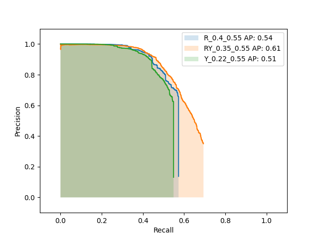
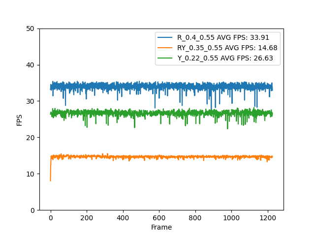
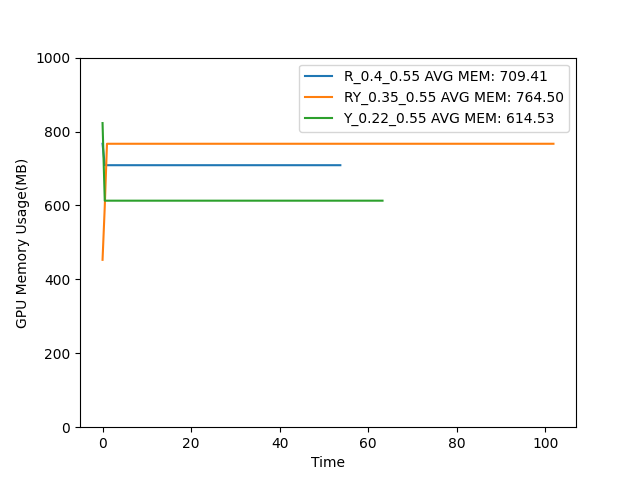
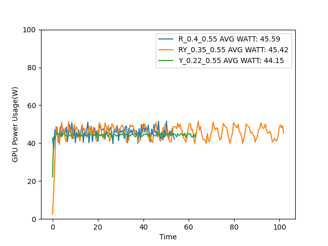

# YOLO12-RTDETR-ensemble-model
Bu repository; Torch modellerinin ONNX formatına dönüşümünü, ONNX fomratında modellere post-process katmanının eklenmesini ve ONNX fomratında 2 ayrı modelin birlikte çalıştırılmasını ele alır.

## Fast-CheckOut

- [Post-Process İşlemleri](#post-process-işlemleri)
- [ONNX İşlemleri](#onnx-işlemleri)
  - [Model2ONNX](#model2onnx)
  - [Yeniden İsimlendirme](#yeniden-isimlendirme)
  - [ONNX Birleştirme](#onnx-birleştirme)
- [Ensemble Model](#ensemble-model)
- [ONNX Modeller](#onnx-modeller)
  - [yolo_out_splitter](#yolo_out_splitter)
  - [rtdetr_out_splitter](#rtdetr_out_splitter)
  - [cxcywh2xyxy](#cxcywh2xyxy)
  - [NMS](#nms)
  - [YOLO_postprocess](#yolo_postprocess--yolo_out_splitter--cxcywh2xyxy--nms)
  - [RTDETR_postprocess](#rtdetr_postprocess--rtdetr_out_splitter--cxcywh2xyxy--nms)
  - [Ensemble_postprocess](#ensemble_postprocess--yolo_out_splitter--rtdetr_out_splitter--cxcywh2xyxy--nms)
- [ONNX to TensorRT](#onnx-to-tensorrt)
- [Model AP/FPS/GPU Değerlendirilmesi](#model-apfpsgpu-değerlendirilmesi)
  - [AP Değerleri](#ap-değerleri)
  - [FPS Değerleri](#fps-değerleri)
  - [GPU Kullanımı](#gpu-kullanımı)

## Modeller:

Çalışma; `rtdetr-l.pt` ve `yolo12l.pt` modellerinin [**Ultralytics**]("https://github.com/ultralytics") kütüphanesi kullanılarak **ONNX** formatına dönüştürülmesi ile başlar.

## Post-Process işlemleri:

Model çıkışları tek başına anlamlı değildir. Yeniden ölçeklendirme ve NMS adımları gereklidir. 

Bu işlemler [**TorchFiles/models.py**](TorchFiles/models.py) dosyasında `torch.nn.Module` sınıfı miras alınarak gerçekleştirilmiştir.

## ONNX işlemleri:

Her iki model için [**TorchFiles/models.py**](TorchFiles/models.py) dosyasında tanımlanan **post-process** katmanları ONNX formatına çevrildikten sonra ilgili model ile birleştirme işlemi yapılır. Birleştirme işlemi yapılmadan varsa ONNX OP isim çakışmalarını önlenmek için ilgili operatör yeniden isimlendirilir ve birleştirilir.

---

### [Model2ONNX](models_to_onnx.py)

**torch.nn.Module** sınıfından bir modeli ONNX formatına çevirmek için `model_to_onnx.py` doosyasındaki `model_to_onnx` fonskiyonu kullanılır.

---

### Yeniden isimlendirme:

[**sor4onnx**](https://github.com/PINTO0309/sor4onnx) aracı kullanılırarak istenilen ONNX modelindeki operatörlerin isimleri değiştirilir.

---

### ONNX birleştirme:

[**snc4onnx**](https://github.com/PINTO0309/snc4onnx) aracı kullanılarak 2 vaye daha fazla model birleştirilir.

---

### Ensemble Model:

RTDETR ve YOLO12 modelleri yukarıda belirtilen fonksiyonlar ile birleştirilmiştir. Birleştirme işlemi modellerin saf çıkışları üzerinden olmuştur. **Feature-fusion** kullanılmammıştır.

## ONNX Modeller:

#### yolo_out_splitter
RAW YOLO12 çıkışını **cxcywh**,**person_conf** olarak 2 ye ayırır

#### rtdetr_out_splitter
RAW RTDETR çıkışını **cxcywh**,**person_conf** olarak 2 ye ayırır

#### cxcywh2xyxy
Bbox fomatını **cxcywh**'dan **x1y1x2y2** formatına dönüştürür. (NMS için gerekli)

#### NMS
Bbox kutularını alır ve önce belirlenen IoU eşik sınırı üzerindeki kutuları sonra Confidence score eşikleme uygulayarak eşik değerinin altındaki kutuları filtreler.

#### YOLO_postprocess = yolo_out_splitter + cxcywh2xyxy + NMS

#### RTDETR_postprocess = rtdetr_out_splitter + cxcywh2xyxy + NMS

#### Ensemble_postprocess = yolo_out_splitter + rtdetr_out_splitter + cxcywh2xyxy + NMS

## ONNX to TensorRT

Daha hızlı inference almak için mantıksal bağlanmış katmanları fiziksel bağlanmış ve GPU ya özgü düzenlenmiş `engine` formatında çalıştırılmıştır.

Bu çevrim [TensorRT inference]() reposu kullanılarak yapılmıştır.

*GTX1650TI GPU kullanılmıştır (**CUDA Capability:7.5**) Değerlendirmelerde göz önünde bulundurulmalıdır* 

## Model AP/FPS/GPU Değerlendirilmesi

Modeller birleştirilemden önce ve birleştirildikten sonraki Tek sınıf(Person) üzerinden AP değeri, [TensorRT inference]() reposundan elde edilen Latency ve GPU-Kullanımı bilgileri, [Average Precision]() reposunda işlenmiş ve çıktılar üretilmiştir.

**R: RTDETR_(scoreThreshold_iouThreshold)**\
**Y:YOLO12_(scoreThreshold_iouThreshold)**\
**RY:RTDETRYOLO12Ensemble_(RscoreThreshold_RIouThreshold_YScoreThreshold_YIouThreshold_RYScoreThreshold_RYIouThreshold)**

### AP Değerleri

### FPS Değerleri 

### GPU Kullanımı
\
