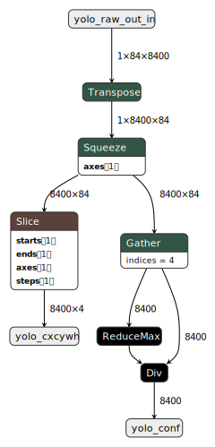
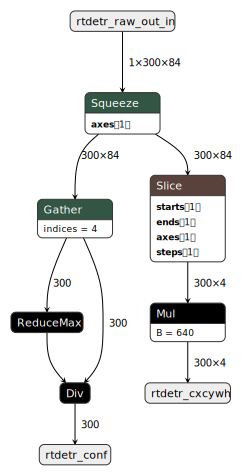
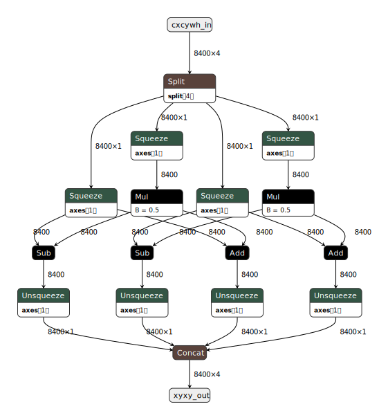
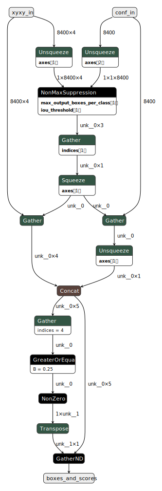
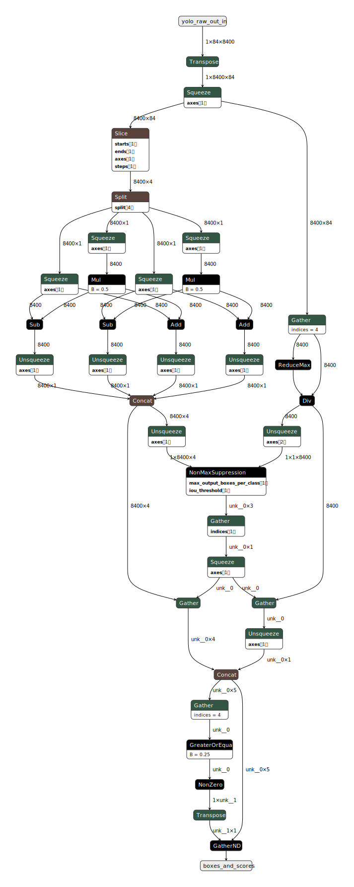
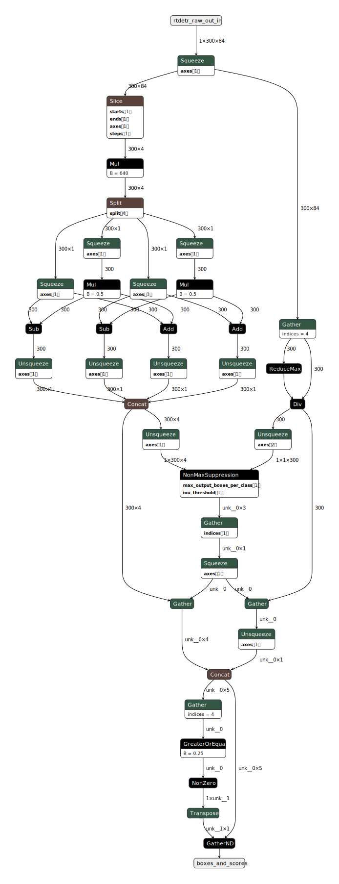
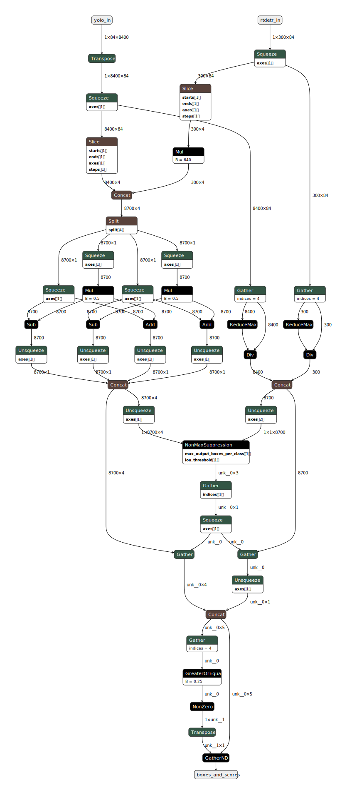

# YOLO12-RTDETR-ensemble-model
Bu repository; Torch modellerinin ONNX formatına dönüşümünü, ONNX fomratında modellere post-process katmanının eklenmesini ve ONNX fomratında 2 ayrı modelin birlikte çalıştırılmasını ele alır.

## Modeller:

Çalışma; `rtdetr-l.pt` ve `yolo12l.pt` modellerinin [**Ultralytics**]("https://github.com/ultralytics") kütüphanesi kullanılarak **ONNX** formatına dönüştürülmesi ile başlar.

## Post-Process işlemleri:

Model çıkışları tek başına anlamlı değildir. Yeniden ölçeklendirme ve NMS adımları gereklidir. 

Bu işlemler [**TorchFiles/models.py**](TorchFiles/models.py) dosyasında `torch.nn.Module` sınıfı miras alınarak gerçekleştirilmiştir.

## ONNX işlemleri:

Her iki model için [**TorchFiles/models.py**](TorchFiles/models.py) dosyasında tanımlanan **post-process** katmanları ONNX formatına çevrildikten sonra ilgili model ile birleştirme işlemi yapılır. Birleştirme işlemi yapılmadan varsa ONNX OP isim çakışmalarını önlenmek için ilgili operatör yeniden isimlendirilir ve birleştirilir.

---

### [Model2ONNX](models_to_onnx.py)

**torch.nn.Module** sınıfından bir modeli ONNX formatına çevirmek için `model_to_onnx.py` doosyasındaki `model_to_onnx` fonskiyonu kullanılır.

---

### Yeniden isimlendirme:

[**sor4onnx**](https://github.com/PINTO0309/sor4onnx) aracı kullanılırarak istenilen ONNX modelindeki operatörlerin isimleri değiştirilir.

---

### ONNX birleştirme:

[**snc4onnx**](https://github.com/PINTO0309/snc4onnx) aracı kullanılarak 2 vaye daha fazla model birleştirilir.

---

### Ensemble Model:

RTDETR ve YOLO12 modelleri yukarıda belirtilen fonksiyonlar ile birleştirilmiştir. Birleştirme işlemi modellerin saf çıkışları üzerinden olmuştur. **Feature-fusion** kullanılmammıştır.

#### yolo_out_splitter

#### rtdetr_out_splitter

#### cxcywh2xyxy

#### NMS

#### YOLO_postprocess = yolo_out_splitter + cxcywh2xyxy + NMS

#### RTDETR_postprocess = rtdetr_out_splitter + cxcywh2xyxy + NMS

#### Ensemble_postprocess = yolo_out_splitter + rtdetr_out_splitter + cxcywh2xyxy + NMS

